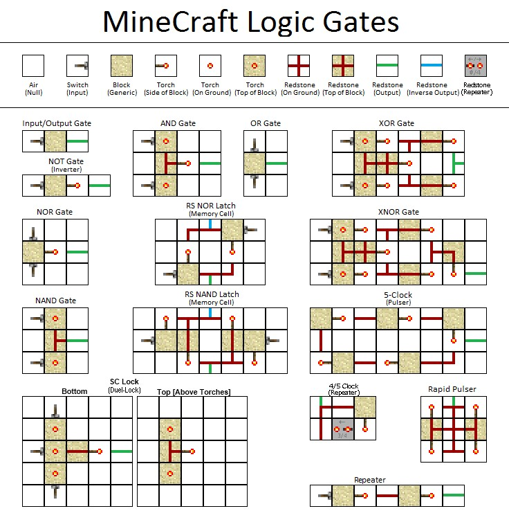
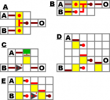
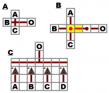
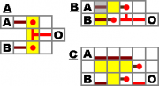
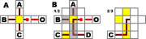
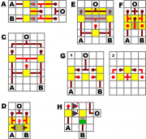
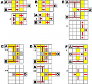

# LogicGates
Curso de Puertas lógicas aplicadas a distintos sistemas de desarrollo.
En este apartado introduciremos los aspectos básicos de creación de puertas lógicas mediante la interpretación de planos y su desarrollo en la programación.

	

<h2> Simple Gates</h2>
<ul>
  <li> Simple Switch</li>
  <li> AND Gate</li>
  <li> OR Gate</li>
  <li> NOT Gate</li>
</ul>

	

  
  

  
  

<h2> Advanced Gates</h2>
<ul>
  <li> NAND Gate</li>
  <li> NOR Gate</li>
  <li> XOR Gate</li>
  <li> XNOR Gate</li>
</ul>

  
  

